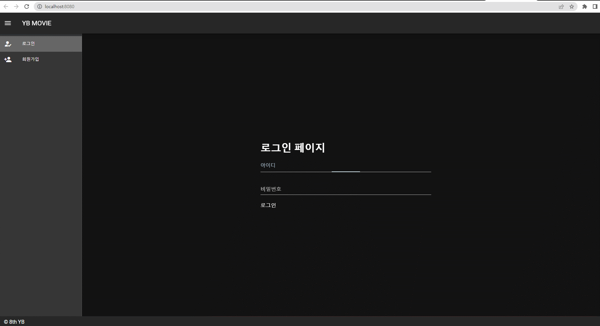
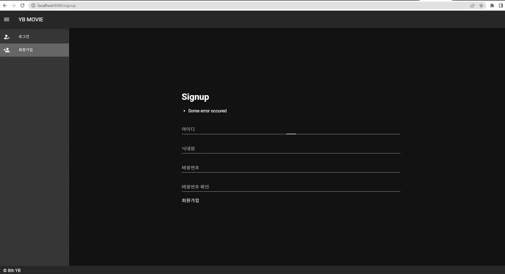

# Final Project - YB MOVIE

## 0. 팀원 소개
 
  | 이름        | 직책     | 업무                   |
  | ----------- | ------- | ---------------------- |
  | 여도현       | 팀장 | django와 월드컵 담당      |
  | 배중권       | 팀원 | 전반적인 vue 프론트단 담당 |

## 0.5. Process

 - `진행 일정`
 
    | 날짜        | 이름     | 작업                   |
    | ----------- | ------- | ---------------------- |
    | 11/16       | 여도현  | django로 db 기초 설계, cors인증 설정 |
    |             | 배중권  |  로그인, 로그아웃 기능 구현       |
    | 11/17       | 여도현  | models.py, views.py 작성 및 월드컵페이지 기초작성         |
    |             | 배중권  | 로그인, 로그아웃, 회원가입 마무리, 프로필 기초 설계              |
    | 11/18       | 여도현   | 월드컵 페이지 추가 작성     |
    |             | 배중권   | 디테일 페이지 기초 작성, 유튜브 api 데이터 받기      |
    | 11/19       | 여도현  | 월드컵 페이지 완성 및 월드컵용 데이터 추가 |
    |             | 배중권  | 디테일 페이지 작성, 리뷰 페이지 수정       |
    | 11/20       | 여도현  | 월드컵 데이터 기반으로 추천영화 출력 완성     |
    |             | 배중권  | 디테일 페이지 작성, 프로필 페이지 작업 시작              |
    | 11/21       | 여도현   | 인덱스 페이지 작업 시작, 인덱스 페이지 호버 구현, 좋아요 기능 추가       |
    |             | 배중권   | 프로필 수정 작업   |
    | 11/22       | 여도현  | 인덱스 페이지 팔로우 기능, 검색기능 추가 |
    |             | 배중권  | 페이지네이션 작업 시작, 완료 |
    | 11/23       | 여도현  | 인덱스 페이지 영화 리스트 랜덤 순서 출력 기능 추가      |
    |             | 배중권  | 프로필 페이지 모달기능 추가, 디테일 페이지 유튜브영상 모달기능 추가   |
    | 11/24       | 여도현   | 월드컵 완료 후 폭죽 기능 추가      |
    |             | 배중권   | 프로필 페이지 완료, 디테일 페이지 완료       |

## 1. Intro

YB MOVIE는 데이터 기반 영화 추천 서비스 입니다.
사용자는 영화에 대한 코멘트를 남길 수 있으며, 영화 이상형월드컵을 이용해 사용자가 선호하는 장르를 파악하여 영화를 추천해주는 서비스입니다.

## 1.5. Algorithm Introduce

저희가 사용한 알고리즘은 월드컵을 진행하는 중 결승전에 진출한 영화 2개를 활용하여 tmdb에 추천 영화를 출력해주는 recommend api를 활용하였습니다. 

## 2. Requirement

1. Python Web Framework

   1. Django 3.2.13

2. Javascript Web Framework

   1. Vue 2.7.14
      - vuex 3.6.2
      - vuetify 2.6.0

## 2. Data

#### -  Seed data

- [네이버 영화](https://movie.naver.com) 영화에 대한 데이터를 수집하였습니다. 

- `db.sqplite3` 에서 테이블간의 관계는 아래와 같습니다.

  - `movies/genre`

    | 필드명 | 자료형  | 설명        |
    | ------ | ------- | ----------- |
    | id     | Integer | Primary Key |
    | name   | String  | 장르 이름   |

  

  - `movies/directors`

    | 필드명      | 자료형  | 설명            |
    | ----------- | ------- | --------------- |
    | id          | Integer | Primary Key     |
    | name        | String  | 감독 이름       |
    | role        | String  | 역할            |
    | img_url     | Text    | 감독 이미지 URL |
    | description | Text    | 감독 설명       |

  
  
  
  - `movies/actors`
  
    | 필드명      | 자료형  | 설명            |
    | ----------- | ------- | --------------- |
    | id          | Integer | Primary Key     |
    | name        | String  | 배우 이름       |
    | role        | String  | 역할            |
    | img_url     | Text    | 배우 이미지 URL |
    | description | Text    | 배우 설명       |
  
  
  
  - `movies/movies`
  
    | 필드명      | 자료형  | 설명                   |
    | ----------- | ------- | ---------------------- |
    | id          | Integer | Primary Key            |
    | title       | String  | 영화 제목              |
    | title_en    | String  | 영화 영문 제목         |
    | rate        | String  | 평점                   |
    | directors   | Array   | 영화 감독들의 pk       |
    | actors      | Array   | 출연 배우들의 pk       |
    | img_url     | Text    | 영화 포스터 이미지 URL |
    | description | Text    | 영화 줄거리            |
    | open_date   | String  | 개봉일                 |
    | genres      | Array   | 영화 장르 pk 리스트    |
    | like_users  | Integer | 영화에 좋아요한 유저   |
    | follow_users| Interger| 영화를 북마크한 유저   |

  - `movies/wordcupMovies`
  
    | 필드명      | 자료형  | 설명                   |
    | ----------- | ------- | ---------------------- |
    | id          | Integer | Primary Key            |
    | title       | String  | 영화 제목              |
    | title_en    | String  | 영화 영문 제목         |
    | rate        | String  | 평점                   |
    | directors   | Array   | 영화 감독들의 pk       |
    | actors      | Array   | 출연 배우들의 pk       |
    | img_url     | Text    | 영화 포스터 이미지 URL |
    | description | Text    | 영화 줄거리            |
    | open_date   | String  | 개봉일                 |
    | genres      | Array   | 영화 장르 pk 리스트    |
    | tmdb        | Integer | 해당 영화의 tmdb pk   |
    | users       | Interger| 해당 영화를 선택한 유저|
  

## 3. Getting Started

### 각각의 폴더로 들어간 뒤 터미널에 명령을 입력하세요.

- backend 폴더에서
  - `python -m venv venv`
  - `source venv/Scripts/activate`
  - 최초 실행할 경우 꼭 수행
    - 데이터베이스 생성
      - `python manage.py migrate`
    - json 데이터를 DB에 dump
      - `python manage.py loaddata movies/worldcupmovies.json movies/newmovie.json movies/movies.json 
         movies/genre.json movies/directors.json movies/actors.json`
  - `python manage.py runserver`
- frontend 폴더에서
  - `npm i`
  - `npm run serve`

## 5. Reuslt

  
 
## 6. 실행 화면

### LOGIN

 

### SIGNUP

 

### HOME

#### 월드컵을 한번도 진행하지 않은 상태면 추천영화 목록이 나오지 않습니다.
#### 전체 영화 목록은 20개씩 페이지의 가장 밑단을 터치하면 새로이 출력됩니다.

 

### WORLDCUP

#### 저희의 대표 기능으로 총 16강으로 진행되며 매 라운드마다 영화의 순서는 랜덤하게 셔플되고 
#### 최종 우승영화와 준우승 영화의 데이터를 저장하여 추천영화에 활용합니다.
 

### RECOMMEND

#### 월드컵을 진행한 이후에는 추천영화 목록 출력

 

### COMMENT

#### 영화의 포스터에 마우스를 가져다 대고 별점을 누르면 comment모달 창이 나옵니다.

 

### DETAIL

#### 디테일 화면에는 영화의 제목, 포스터, 평점, 댓글, 관련 영상, 줄거리가 나옵니다.

 

### SEARCHBOOKMARK

#### 검색기능과 북마크 기능이 있어 두가지 동시에 적용이 가능합니다.

 

## 7. 느낀점 및 후기
 
  | 이름        | 소감                     |
  | ----------- | ----------------------------- |
  | 여도현       | 처음에는 어떻게 진행해야 할지 많이 막막했는데 한땀 한땀 만들어 나가면서 자신감이 붙었고 시간이 더 주어진다면 훨씬 많은 기능을 추가할 수 있을꺼같은 자신감을 얻었습니다.   또한 데이터를 왜 서버단에서 처리해야 하는지 느끼게 되는 프로젝트였습니다.|
  | 배중권       | 소감 작성 |
