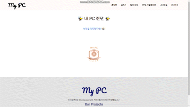

# project1

---

## My PC - 퍼스널 컬러 진단 키오스크, 웹페이지 제작

---

#### My PC 링크(웹, 모바일) : [http://i8c201.p.ssafy.io:3000](http://i8c201.p.ssafy.io:3000/)

---

#### 프로젝트 진행 기간

2023.01.03 ~ 2023.02.17(총 7주)

---

#### My PC - 특장점

- ##### 빠르고 간편한 퍼스널컬러 진단

  - 많은 사람들이 자신의 퍼스널 컬러를 모르는데 그 이유는 비싼 비용, 꽉 차 있는 예약시스템 그리고 직접 가야되는 귀찮기때문이다.

  - 진단이 필요한 상황이 면접이나 정장을 맞출 때 등 외에는 거의 전무하다.

  - 그렇다고 진단이 필요한 상황에 진단을 하느냐? 그것도 아니다. 왜? 진단 과정이 귀찮고, 시간과 비용이 부담이 되어서.

  - 우리 시스템을 이용하면 10초면 진단이 가능하다. 진단을 위해 귀찮게 어딜 찾아가야할 필요도 없다. 비용도 들지 않는다.

- ##### 사용자의 제품 선택을 보조한다

  - 퍼스널 컬러에 적합한 화장품, 예를 들어 파운데이션의 호수나 블러셔의 색상 등, 의류라면 어울리는 색상과 조합을 추천하기 때문에 사용자의 제품 선택을 보조할 수 있다. 사용자의 구매욕을 높여 수익성 증대로도 이어질 것이다.

- ##### 기업의 제품 기획 단계에서 손실 최소

  - 키오스크에서 진단을 마친 사용자들의 컬러 데이터가 데이터베이스에 숫자로

    저장되어있기 때문에 제품 기획 단계에서 손실이 줄어든다. 예를 들어 100명의 사람이 진단을 하였고 70명의 사람이 봄 웜톤 컬러로 진단, 나머지 30명의 사람이 여름,가을,겨울 컬러로 분산되어있다고 가정하자. 제품 기획 단계에서 봄 웜톤에게 어울리는 색상의 의류와 화장품 호수를 주력으로 제작하거나, 홍보하였을 때 기존의 기획과 제작방식보다 재고관리에 용이하고 수익성 또한 증대될 수 있을 것이다.

---

#### 주요 기능

- ##### 퍼스널 컬러 진단

- ##### 게시글(개인PC 별 게시판 나눔)

- ##### 화장 시뮬레이션

- ##### 팔로우

---

#### 주요 기술

###### Backend

- node.js

- express

###### Frontend

- React

###### CI/CD

- AWS

- Jenkins

---

#### 프로젝트 파일 구조

##### Back

```
backend
  ├── BeautyGAN
  ├── config
  │   └── db
  ├── images
  ├── MobileNetV2
  ├── models
  │   ├── board
  │   ├── index
  │   ├── story
  │   └── user
  ├── node_module
  ├── distance.py
  ├── Dockerfile
  ├── encoding_img_list.pkl
  ├── makeup.py
  ├── package-lock.json
  ├── package.json
  ├── personalcolor.py
  ├── README.md
  ├── requirements.txt
  ├── server.js
  └── storage.js
```

##### Front

```
frontend
  ├── node_modules
  ├── public
  ├── config
  ├── scripts
  └── src
      ├── App.css
      ├── App.js
      ├── App.test.js
      ├── index.css
      ├── index.js
      ├── logo.svg
      ├── reportWebVitals.js
      ├── setupTests.js
      ├── components
      │   ├── Card
      │   ├── ChangePc
      │   ├── ColorSelector
      │   ├── Home
      │   ├── ImageUploader
      │   ├── MakeUp
      │   ├── MyProfileimageUploader
      │   ├── OutputImg
      │   ├── ProfileCard
      │   ├── SeasonSelector
      │   ├── StoryEdit
      │   ├── StoryUploader
      │   └── TextArea
      ├── Layout
      │   ├── Footer
      │   └── Header
      ├── pages
      │   ├── Addboard
      │   ├── Board
      │   ├── BoardList
      │   ├── EditPage
      │   ├── Login
      │   ├── MakeUp
      │   ├── MyProfile
      │   ├── PersonalColor
      │   ├── Season
      │   ├── SignPersonalColor
      │   ├── Signup
      │   ├── StoryCreator
      │   ├── StoryUploader
      │   └── UserProfile
      ├── redux
      ├── routes
      └── utils
          ├── api.js
          └── jwtUtils.js
```

---

#### 협업 툴

- Git

- JIRA

- MatterMost

- Webex

---

#### 협업 환경

- Gitlab
  - 코드의 버전을 관리
  - 이슈 발행, 해결을 위한 토론
  - 머지시 코드리뷰 후 피드백

- JIRA
  - 매주 목표량을 설정하고 등록하여 Sprint 진행
  - 업무의 할당량을 정하여 Story Point를 설정

- 스크럼 회의
  - 매일 아침마다 오늘 할 일을 생각하고 실행 

---

#### My PC 서비스 화면

- ###### 회원가입
  - 아이디 중복 제한
  - 비밀번효 유효성 검증
  - 회원가입 페이지에서 PC진단 가능


- ###### 게시판
  - 봄, 여름, 가을, 겨울 별 커뮤니티 공유
  - 톤 별 Best Color과 Worst Color 제공


- ###### 게시물 등록
  - 추천하고 싶은 아이템 등록 가능


- ###### 내 PC 진단
  - 내 PC 진단 기능



- ###### 화장 시뮬레이션
  - 톤 별 기본 화장 이미지 6개 제공
  - 자신의 사진에 화장을 입힐 수 있음
  - 만족시 결과 사진과 유사한 5장 불만족시 상반된 사진 5장 추천


- ###### 내 프로필
  - 프로필 이미지 등록기능
  - 자기소개 등록기능
  - 내가 작성한 게시물 확인 가능
  - 내 팔로워수 확인 


- ###### 유저 프로필
  - 팔로우기능
  - 유저의 게시글 확인


---