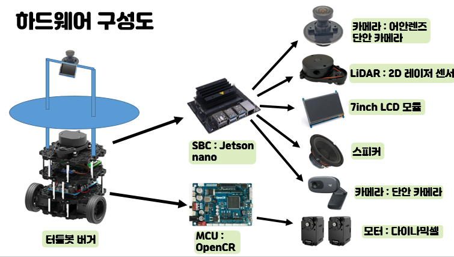

# README

# 🐢부르미🐢

### vSLAM기반 자율주행 서비스 로봇


## ✨ 프로젝트 소개

VSLAM기반 자율주행 서비스 로봇은 실내에서 물건을 전달해주는 수요응답형 서비스 로봇입니다. 로봇은 실내 지도작성, 위치추정, 장애물 회피 기능을 수행합니다. 천장을 보는 카메라를 이용하여 VSLAM을 사용하기에 빠르게 지도작성을 수행하고 초기세팅시간이 짧은 장점이 있습니다. 구체적인 서비스는 호출, 배송, 취소, 대기열 등록이 있습니다.

## 🙂 기획 배경

---

보급형 서비스 로봇을 만들기 위해 개발

## 😎 서비스 기능

---

1. 로봇 호출용 웹페이지 (사용 대기열 등록)
2. vSLAM(ORB SLAM3)과 LiDAR를 통한 자율주행
3. GUI 용 로봇 스크린
4. 음성 메시지 녹음 및 출력

## 👀 Overview

---

### 1. Main


### 2. Record, Remove


### 3. Signup


### 4. Order


### 5. Login


## 🦄 기대효과 & 발전방향

---

### 기대효과

1. Marker-less 방식
마커 없는 완전자율 주행 방식
초기 세팅이 빠르다.
2. 값싼 센서로 저렴한 로봇
카메라(5만원) + 라이다(20만원)
보급형 서빙 로봇 탄생

### 발전방향

1. VI SLAM 을 통한 자율주행
Visual + Inertial 사용하여 더 정밀한 위치 추적
2. BLDC 모터를 탑제하여 더 조용하고 더 빠른 자율주행

## 💻 Tech Stack

---




## Backend( VM-Ubuntu18.04 )

---

```bash
cd server
nodemon server.js
```

### Frontend

---

```bash
cd client
npm start
```

## 🤼‍♂️ Author

---

Team Leader & 자율주행, 디자인: 🐯김지호

만능왕 : 🐱 문병수

영상처리 : 🐶 송하엽

임베디드 : 🐺 황효상

자율주행 : 🐱 지이주

Full Stack : 🦁 배중권